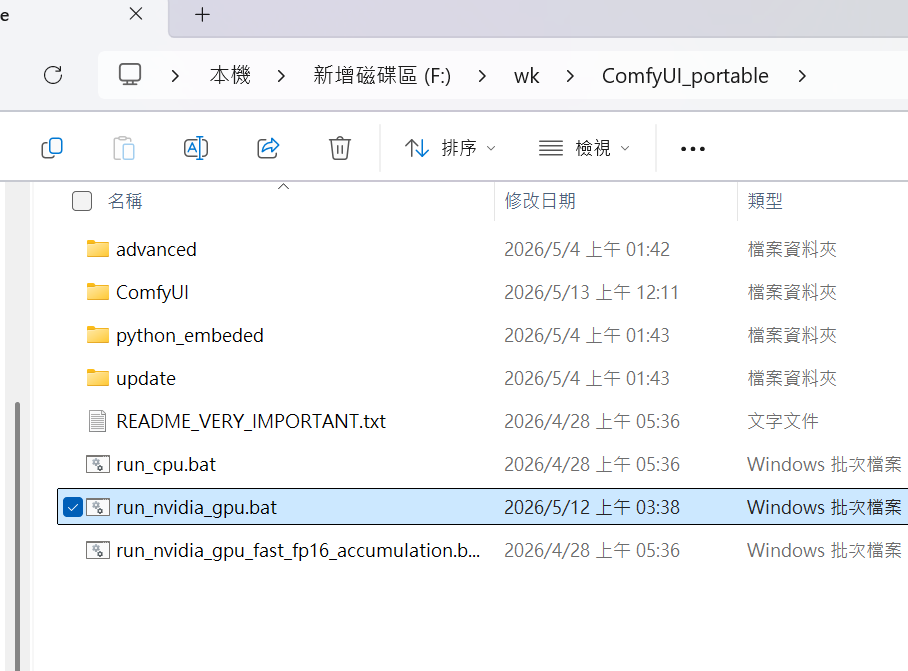
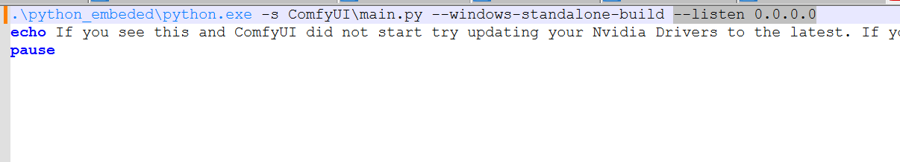
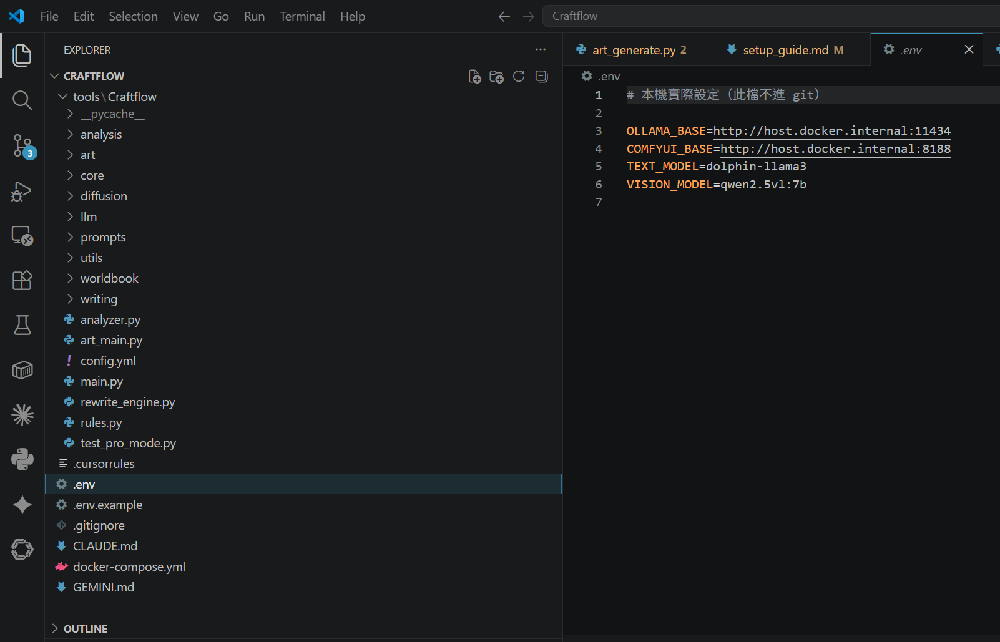

# Craftflow 快速建置操作手冊

**適用版本：** Phase 1
**最後更新：** 2026-05-13

---

## 前置需求（所有裝置共用）

| 工具 | 版本 | 說明 |
|---|---|---|
| Git | 任意 | 拉取程式碼 |
| Docker Desktop | 4.x+ | 執行 Backend + Frontend |
| Ollama | 最新 | 本地 LLM 服務 |
| Node.js | **20 LTS** | 本地前端開發（非 Docker 啟動時需要） |

### 安裝指令（Windows / PowerShell）

以下使用 [winget](https://learn.microsoft.com/zh-tw/windows/package-manager/winget/)（Windows 11 內建），一次安裝所有工具：

```powershell
# Git
winget install --id Git.Git -e

# Docker Desktop
winget install --id Docker.DockerDesktop -e

# Ollama
winget install --id Ollama.Ollama -e

# Node.js 20 LTS
winget install --id OpenJS.NodeJS.LTS -e --version 20.19.1
```

> 安裝完成後**重新開啟 PowerShell**，讓 PATH 生效。

確認安裝成功：

```powershell
git --version        # git version 2.x.x
docker --version     # Docker version 2x.x.x
ollama --version     # ollama version 0.x.x
node --version       # v20.x.x
npm --version        # 10.x.x
```

---

## 步驟 0 — 依硬體選擇模型

> **目標：** 所有 AI 功能在 **1–3 分鐘內**完成。  
> **決定因素：** 有 GPU 看 **VRAM**，無 GPU 看 **RAM**。  
> 確認後，把對應的 `TEXT_MODEL` / `VISION_MODEL` 填入 `.env`。

### 有 GPU（NVIDIA RTX 系列）

時間估算欄位：**文字分析** / **視覺分析** / **ComfyUI 生圖**（均為單次作業）

| GPU 型號 | VRAM | TEXT_MODEL | VISION_MODEL | 文字 | 視覺 | ComfyUI | ≤3min |
|---|---|---|---|---|---|---|---|
| RTX 5090 | 32GB | `qwen2.5:14b` | `qwen2.5vl:7b` | ~12s | ~20s | ~35s | ✅ |
| RTX 4090 / 3090 | 24GB | `qwen2.5:14b` | `qwen2.5vl:7b` | ~17s | ~27s | ~50s | ✅ |
| RTX 5070 Ti / 4080 | 16GB | `dolphin-llama3` | `qwen2.5vl:7b` | ~25s | ~40s | ~75s | ✅ ← **當前配置** |
| RTX 5070 / 3080 Ti | 12GB | `dolphin-llama3` | `llava:7b` | ~33s | ~53s | ~100s | ✅ |
| RTX 4070 / 3060 12GB | 12GB | `dolphin-llama3` | `llava:7b` | ~38s | ~62s | ~110s | ✅ |
| RTX 4060 Ti / 3070 | 8GB | `llama3.2:3b` | `llava:7b` | ~50s | ~80s | ~2.5min | ✅ |
| RTX 4060 / 3060 8GB | 8GB | `llama3.2:3b` | `moondream` | ~60s | ~100s | ~3min | ⚠️ 邊緣 |

> ⚠️ **8GB VRAM**：ComfyUI 生圖可能剛好壓線，解析度建議不超過 512×512。  
> ✳️ **視覺分析 ~40s** 為 RTX 5070 Ti 實測值（`qwen2.5vl:7b`，2026-05-13）。其餘為等比推算。

### 無 GPU（CPU 模式）

> ❌ **CPU 模式無法達到 1–3 分鐘目標**，ComfyUI 圖像生成亦不可用。  
> 適合純文字功能的輕度使用或暫時替代方案。

| RAM | TEXT_MODEL | VISION_MODEL | 文字 | 視覺 |
|---|---|---|---|---|
| 64GB | `llama3.2:8b` | `llava:7b` | ~5min | ~10min |
| 32GB | `llama3.2:8b` | `llava:7b` | ~6min | ~13min |
| 16GB | `llama3.2:3b` | `moondream` | ~10min | ~20min+ |

> CPU 型號（i5 12代 ~ AMD 9800X3D）影響速度但不影響模型選擇；RAM 才是瓶頸。

---

## 情境 A — Windows 主力機（有 GPU）

> RTX 系列顯卡，全功能可用（含 ComfyUI 圖像生成）

### 1. 啟動 Ollama

```powershell
# 讓 Ollama 監聽所有介面（Docker 容器才能連進來）
$env:OLLAMA_HOST = "0.0.0.0"
ollama serve
```

依**步驟 0** 查到的型號拉取模型（首次需要時間，依網速而定）：

```powershell
ollama pull <TEXT_MODEL>      # 文字 / 翻譯，例如 dolphin-llama3
ollama pull <VISION_MODEL>    # 視覺分析，例如 qwen2.5vl:7b
```

### 2. 啟動 ComfyUI

進入 ComfyUI 資料夾，執行：

```powershell
.\run_nvidia_gpu.bat -- --listen 0.0.0.0
```
圖中為ComfyUI_portable


> `--listen 0.0.0.0` 讓 Docker 容器可以連進 ComfyUI。

### 3. 複製專案與設定環境

```powershell
git clone <repo-url> Craftflow
cd Craftflow
copy .env.example .env
```
配置如圖(5070ti)



依**步驟 0** 的結果，開啟 `.env` 確認或修改模型設定：

```env
TEXT_MODEL=dolphin-llama3    # ← 依步驟 0 的建議填入
VISION_MODEL=qwen2.5vl:7b   # ← 同上
```

> 💡 **之後換裝置或更換模型**：只需修改 `.env` 的這兩行，再執行 `docker compose down && docker compose up` 即可，不需改任何程式碼。

### 4. 啟動 Docker 服務

```powershell
docker compose up --build
```

### 5. 確認服務

| 服務 | 網址 |
|---|---|
| Backend API | http://localhost:8000/api/v1/status |
| Frontend | http://localhost:3000 |
| Ollama | http://localhost:11434 |
| ComfyUI | http://localhost:8188 |

---

## 情境 B — 無 GPU 輕量機

> 筆電或無顯卡機器。ComfyUI 圖像生成功能**不可用**，其他 AI 文字功能可用（速度較慢）。

### 1. 啟動 Ollama（CPU 模式）

```powershell
$env:OLLAMA_HOST = "0.0.0.0"
ollama serve
```

依**步驟 0** 查到的型號拉取模型：

```powershell
ollama pull <TEXT_MODEL>      # 例如 llama3.2:3b
ollama pull <VISION_MODEL>    # 例如 moondream
```

### 2. 複製專案與設定環境

```powershell
git clone <repo-url> Craftflow
cd Craftflow
copy .env.example .env
```

編輯 `.env`，替換模型為輕量版：

```env
TEXT_MODEL=llama3.2:3b
VISION_MODEL=llava:7b
```

> ComfyUI 不在此裝置執行，`COMFYUI_BASE` 保持預設即可——系統偵測不到時會顯示提示但不會崩潰。

### 3. 啟動 Docker 服務

```powershell
docker compose up --build
```

### 4. 可用功能一覽

| 功能 | 有 GPU | 無 GPU |
|---|---|---|
| 小說管理 / 章節 CRUD | ✅ | ✅ |
| 節奏分析（規則型） | ✅ | ✅ |
| 一致性 surface scan | ✅ | ✅ |
| AI 文字改寫建議 | ✅ | ✅（較慢）|
| 草稿視覺分析 | ✅ | ✅（較慢）|
| ComfyUI 線稿化 / 風格強化 | ✅ | ❌ |

---

## 常見問題

**Q: Backend 啟動後 `/api/v1/status` 顯示 Ollama unavailable？**
確認 Ollama 已用 `OLLAMA_HOST=0.0.0.0` 啟動，且 docker-compose.yml 中有 `extra_hosts: host.docker.internal:host-gateway`。

**Q: ComfyUI 連不上？**
確認啟動指令包含 `--listen 0.0.0.0`，否則預設只監聽 127.0.0.1，Docker 容器無法連入。

**Q: 換了裝置想用不同模型？**
只需修改 `.env` 中的 `TEXT_MODEL` / `VISION_MODEL`，重啟 Docker 即生效，不需改任何程式碼。
